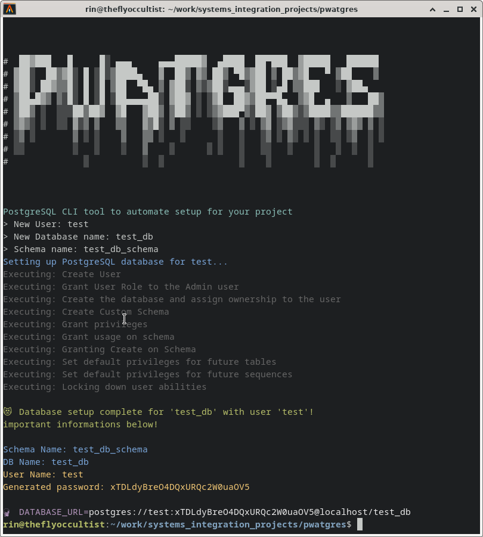

# 🐘 RinkakuWorks Pwatgres CLI

A magical terminal-based Ruby CLI to **automate PostgreSQL user, database, and schema setup** with style. Say goodbye to manually typing `psql` commands like it's 2011.

This script:
- Creates a new PostgreSQL user with a secure password.
- Creates a new database owned by that user.
- Sets up a custom schema and grants appropriate privileges.
- Logs every query execution for easier debugging.
- Outputs credentials and connection info in a colorful terminal experience.



---

## ✨ Features

- 🔐 Secure password generation with `SecureRandom`
- 🧙‍♀️ Elegant logging with `run_query` helper to locate failing SQL
- 🎨 Terminal-friendly output with `colorize`
- 🎭 ASCII Art for maximum flair
- 📜 Postgres connection string (optional output)

---

## 🔧 Requirements

- Ruby (2.7+ recommended)
- PostgreSQL client libraries (`libpq-dev`)
- `pg`, `dotenv`, `readline`, and `colorize` gems

Install dependencies:

```bash
bundle install
```

---

## 🧪 Running the Script

Ensure you have a .env file with:

```
PG_CLI_USER=your_admin_user
PG_CLI_PASS=your_admin_password
```

Run the setup script:

```
bundle exec ruby pg_user.rb
```

You'll be prompted for:

- The new PostgreSQL **username**
- The **database name**
- The **schema name**

At the end, the script will output the generated password and optionally a ready-to-use `DATABASE_URL`.

---

## 🛡 Permissions Note

Your PG_CLI_USER should:

- Be able to `CREATE ROLE` and `CREATE DATABASE`
- It does **not** need to be a superuser, but will require temporary `GRANT` permissions to create databases owned by other users

If you see errors like:

```
ERROR: must be member of role "username"
```

You likely need to:

```
GRANT your_new_user TO your_admin_user;
```

---

## 💀 Known Limitations

- Does not support remote database setups (assumes local Unix socket `/var/run/postgresql`)
> [!TIP]
> Try running the SQL query `SHOW unix_socket_directories;` to confirm your database setup.
- Does not revoke specific table-level privileges (handled by default privileges logic)
- Only supports PostgreSQL (obviously)

---

## 🧙 Author Notes

This is part of the **TSSR curriculum and system integration practice.** Originally developed as a crash-test project to turn DB setup from dread into a dramatic one-liner.

You are encouraged to customize it and break things.
